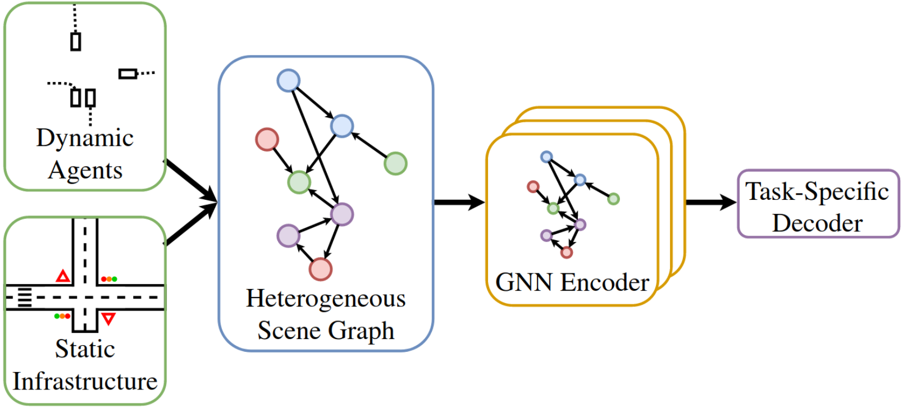

# SCENE: Reasoning about Traffic Scenes using Heterogeneous Graph Neural Networks

Official repository of the paper:\
**[SCENE: Reasoning about Traffic Scenes using Heterogeneous Graph Neural Networks](https://arxiv.org/abs/2301.03512)**\
Thomas Monninger*, Julian Schmidt*, Jan Rupprecht, David Raba, Julian Jordan, Daniel Frank, Steffen Staab and Klaus Dietmayer\
*Thomas Monninger and Julian Schmidt are co-first authors. The order was determined alphabetically.\
\
IEEE Robotics and Automation Letters (RA-L), 2023



The repository contains the source code of our graph convolution operator and our experiments on publicly available knowledge graph datasets.

## Citation
If you use our source code, please cite:
```bibtex
@Article{monningerschmidt2023scene,
  author={Monninger, Thomas and Schmidt, Julian and Rupprecht, Jan and Raba, David and Jordan, Julian and Frank, Daniel and Staab, Steffen and Dietmayer, Klaus},
  journal={IEEE Robotics and Automation Letters}, 
  title={SCENE: Reasoning About Traffic Scenes Using Heterogeneous Graph Neural Networks}, 
  year={2023},
  volume={8},
  number={3},
  pages={1531--1538},
  doi={10.1109/LRA.2023.3234771}}
```

## License
<a rel="license" href="http://creativecommons.org/licenses/by-nc/4.0/">
</a><br />SCENE is licensed under <a rel="license" href="http://creativecommons.org/licenses/by-nc/4.0/"
 >Creative Commons Attribution-NonCommercial 4.0 International License</a>.
 
Check [LICENSE](LICENSE) for more information.

## Installation
### Install Anaconda
We recommend using Anaconda.
The installation is described on the following page:\
https://docs.anaconda.com/anaconda/install/linux/

### Install Required Packages
```sh
conda env create -f environment.yml
```

### Activate Environment
```sh
conda activate scene
```

## Generate Results
```sh
python3 main.py --dataset=aifb
```
Options for `--dataset` are `aifb`, `mutag`, `bgs` and `am`.

## Results
Results are stored in the `results/` folder.
By default, it contains the original results obtained on our test system.\
Values are reported in [our paper](https://arxiv.org/abs/2301.03512).\
Test system specifications: Intel Core i9-7920X, NVIDIA GeForce RTX 2080 Ti.